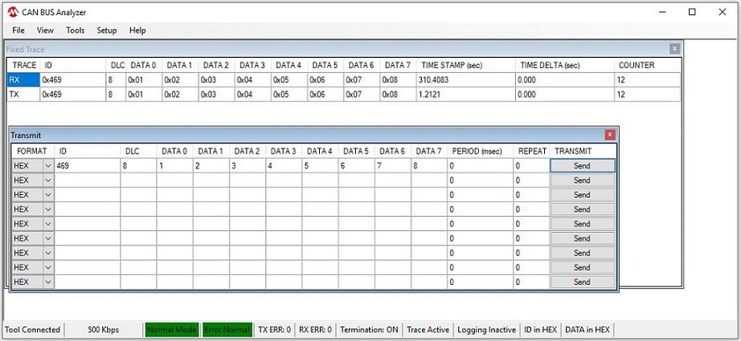

# CAN blocking

This example application shows how to use the CAN module to transmit and receive normal CAN messages in polling mode.

## Description

This application transmits CAN message to CAN Bus and receives CAN message from CAN Bus. To run this application, an evaluation board and [Microchip CAN Bus Analyzer](http://www.microchip.com/Developmenttools/ProductDetails/APGDT002) is required . They act as different nodes on the CAN bus. While running the application, user can send and receive CAN messages between the board and the analyzer.

## Downloading and building the application

To clone or download this application from Github, go to the [main page of this repository](https://github.com/Microchip-MPLAB-Harmony/csp_apps_pic32mx) and then click **Clone** button to clone this repository or download as zip file.
This content can also be downloaded using content manager by following these [instructions](https://github.com/Microchip-MPLAB-Harmony/contentmanager/wiki).

Path of the application within the repository is **apps/can/can_normal_operation_blocking/firmware** .

To build the application, refer to the following table and open the project using its IDE.

| Project Name      | Description                                    |
| ----------------- | ---------------------------------------------- |
| pic32mx_125_sk.X | MPLABX project for [PIC32MX1/2/5 Starter Kit](https://www.microchip.com/Developmenttools/ProductDetails/dm320100) |
| pic32mx_eth_sk2.X | MPLABX project for [PIC32 Ethernet Starter Kit](https://www.microchip.com/DevelopmentTools/ProductDetails/PartNO/DM320004) |
|||

## Setting up the hardware

The following table shows the target hardware for the application projects.

| Project Name| Board|
|:---------|:---------:|
| pic32mx_125_sk.X | [PIC32MX1/2/5 Starter Kit](https://www.microchip.com/Developmenttools/ProductDetails/dm320100) |
| pic32mx_eth_sk2.X | [PIC32 Ethernet Starter Kit](https://www.microchip.com/DevelopmentTools/ProductDetails/PartNO/DM320004) |
|||

### Setting up [PIC32MX1/2/5 Starter Kit](https://www.microchip.com/Developmenttools/ProductDetails/dm320100)

- To run the demo, the following additional hardware are required:
  - [Microchip CAN Bus Analyzer](http://www.microchip.com/Developmenttools/ProductDetails/APGDT002)

- Install [Microchip CAN Bus Analyzer](http://www.microchip.com/Developmenttools/ProductDetails/APGDT002) software on PC
- Connect [Microchip CAN Bus Analyzer](http://www.microchip.com/Developmenttools/ProductDetails/APGDT002) to J6 connector using male to female DB9 serial cable
- Connect [Microchip CAN Bus Analyzer](http://www.microchip.com/Developmenttools/ProductDetails/APGDT002) to PC using USB Male-A to Male Mini-B cable
- Connect mini USB cable to the 'Debug USB' connector(J3) on the board to the computer.

### Setting up [PIC32 Ethernet Starter Kit](https://www.microchip.com/DevelopmentTools/ProductDetails/PartNO/DM320004)

- To run the demo, the following additional hardware are required:
  - [Microchip CAN Bus Analyzer](http://www.microchip.com/Developmenttools/ProductDetails/APGDT002)
  - [Starter Kit I/O Expansion Board](https://www.microchip.com/DevelopmentTools/ProductDetails/PartNO/DM320002)
  - [CAN/LIN PICtail (Plus) Daughter Board](https://www.microchip.com/DevelopmentTools/ProductDetails/PartNO/AC164130-2)

- Install [Microchip CAN Bus Analyzer](http://www.microchip.com/Developmenttools/ProductDetails/APGDT002) software on PC
- Connect J1 connector on board to J1 connector on [Starter Kit I/O Expansion Board](https://www.microchip.com/DevelopmentTools/ProductDetails/PartNO/DM320002)
- Connect J4 connector on [Starter Kit I/O Expansion Board](https://www.microchip.com/DevelopmentTools/ProductDetails/PartNO/DM320002) to J7 connector on [CAN/LIN PICtail (Plus) Daughter Board](https://www.microchip.com/DevelopmentTools/ProductDetails/PartNO/AC164130-2)
- Connect [Microchip CAN Bus Analyzer](http://www.microchip.com/Developmenttools/ProductDetails/APGDT002) to P1 connector on [CAN/LIN PICtail (Plus) Daughter Board](https://www.microchip.com/DevelopmentTools/ProductDetails/PartNO/AC164130-2) using female to female DB9 serial cable
- Short (close) Jumper J5 on PIC32MX Ethernet Starter Kit II
- Connect [Microchip CAN Bus Analyzer](http://www.microchip.com/Developmenttools/ProductDetails/APGDT002) to PC using USB Male-A to Male Mini-B cable
- Connect mini USB cable to the 'Debug USB' connector(J7) on the board to the computer

## Running the Application

1. Build and program the application project using its respective IDE
2. Open [Microchip CAN Bus Analyzer](http://www.microchip.com/Developmenttools/ProductDetails/APGDT002) software and make the following configurations:

    |Description | Settings  |
    | ---------- | --------- |
    | CAN Bitrate Control | 500 Kbps |
    | CAN Mode Control | Normal Mode |
    | Bus Termination Control | ON  |
    |||

3. Press Switch to transmit message to CAN Bus from board
4. CAN message will be displayed in the CAN analyzer software
5. Send following CAN message from CAN analyzer software
    - ID : 0x469, DLC : 8, Data: 1, 2, 3, 4, 5, 6, 7, 8

    

6. LED toggles at each message transmission or reception

   | Board | Switch Name | LED name |
   |------ | -------- | ----------- |
   | [PIC32MX1/2/5 Starter Kit](https://www.microchip.com/Developmenttools/ProductDetails/dm320100) | SW1 | LED1 |
   | [PIC32 Ethernet Starter Kit](https://www.microchip.com/DevelopmentTools/ProductDetails/PartNO/DM320004) | SW1 | LED1 |
   |||
